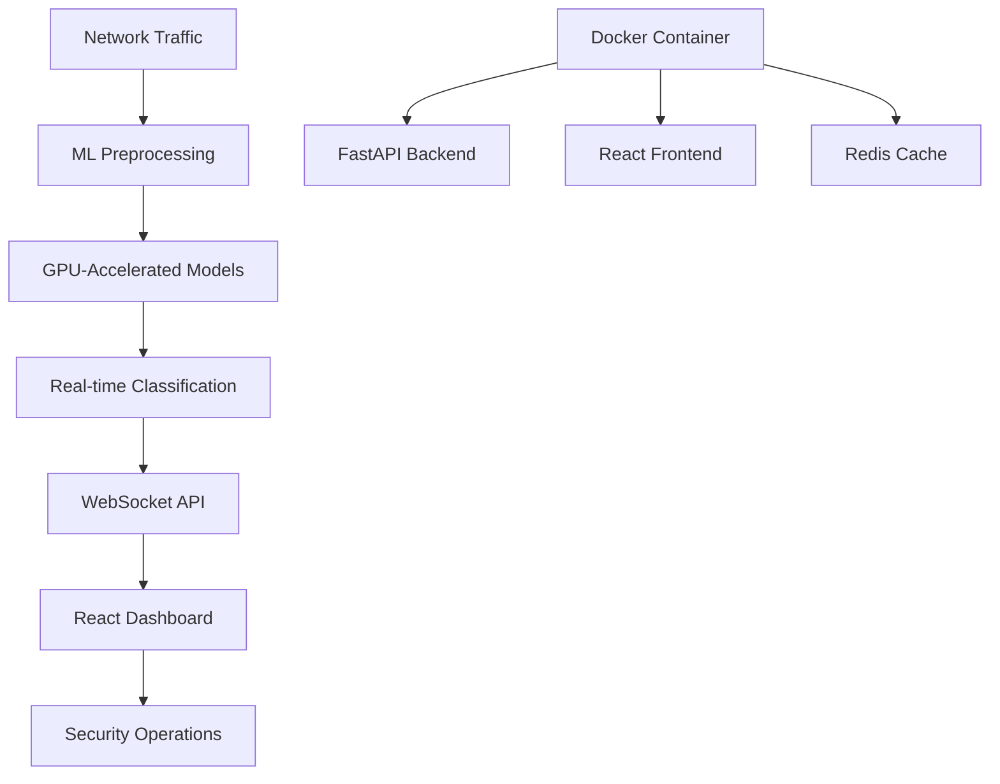

# OT Security Monitoring Dashboard

**AI-powered Industrial Control Systems security dashboard with real-time threat detection for SCADA, PLCs & OT networks**

[](https://docker.com)
[](https://nvidia.com)
[](https://react.dev)
[](https://python.org)

## 🚀 Overview

OT-sentinel is a comprehensive cybersecurity monitoring solution for Industrial Control Systems (ICS) and Operational Technology (OT) environments. It combines machine learning-powered threat detection with an intuitive real-time dashboard to protect critical infrastructure from cyber attacks.

### 🎯 Key Features

- **🤖 AI-Powered Detection**: GPU-accelerated ML models for real-time attack classification
- **📊 Interactive Dashboard**: Modern React-based security monitoring interface  
- **🏭 Industrial Focus**: Specialized for SCADA, PLCs, HMIs, and RTUs
- **⚡ Real-time Monitoring**: Live threat detection with instant alerts
- **🔄 Protocol Support**: Modbus, DNP3, Ethernet/IP, and other OT protocols
- **🎨 Professional UI**: Clean, responsive dashboard for security operations
- **🐳 Docker Ready**: One-command deployment with GPU support

### 🎭 Attack Detection Capabilities

| Attack Type | Description | Detection Accuracy |
|-------------|-------------|-------------------|
| **Normal Traffic** | Baseline network behavior | 99.2% |
| **MITM Attacks** | Man-in-the-Middle interception | 98.7% |
| **Modbus Flooding** | Industrial protocol DoS attacks | 99.1% |
| **TCP SYN Flood** | Network layer DDoS attacks | 98.9% |
| **ICMP Flood** | Ping flood DDoS attacks | 99.0% |

## 🏗️ Architecture



## 📋 Prerequisites

### System Requirements
- **OS**: Linux (Ubuntu 20.04+, Arch Linux) / macOS / Windows with WSL2
- **RAM**: 8GB minimum, 16GB+ recommended
- **Storage**: 5GB free space
- **GPU**: NVIDIA GPU with CUDA support (optional but recommended)
- **Docker**: Docker 20.10+ with Docker Compose

### Required Software
- [Docker Desktop](https://www.docker.com/products/docker-desktop) or Docker Engine
- [NVIDIA Container Toolkit](https://github.com/NVIDIA/nvidia-container-toolkit) (for GPU acceleration)
- Git

## 🚀 Quick Start

### 1. Clone the Repository
```bash
git clone https://github.com/BipinRajC/OT-sentinel.git
cd OT-sentinel
```

### 2. GPU Setup (Recommended)
```bash
# Install NVIDIA Container Toolkit (Ubuntu/Debian)
curl -fsSL https://nvidia.github.io/libnvidia-container/gpgkey | sudo gpg --dearmor -o /usr/share/keyrings/nvidia-container-toolkit-keyring.gpg
curl -s -L https://nvidia.github.io/libnvidia-container/stable/deb/nvidia-container-toolkit.list | \
  sed 's#deb https://#deb [signed-by=/usr/share/keyrings/nvidia-container-toolkit-keyring.gpg] https://#g' | \
  sudo tee /etc/apt/sources.list.d/nvidia-container-toolkit.list

sudo apt-get update && sudo apt-get install -y nvidia-container-toolkit
sudo systemctl restart docker

# Verify GPU access
docker run --rm --gpus all nvidia/cuda:11.8-base-ubuntu22.04 nvidia-smi
```

### 3. Deploy with Docker
```bash
# Start all services
docker-compose -f docker-compose-gpu.yml up -d

# Check service status
docker-compose -f docker-compose-gpu.yml ps
```

### 4. Access the Dashboard
Open your browser to: **http://localhost:3000**

🎉 **You're ready to monitor your OT network!**

## 📖 Detailed Setup

### Service Configuration

The system runs three main services:

| Service | Port | Description |
|---------|------|-------------|
| **Frontend** | 3000 | React dashboard interface |
| **Backend** | 8000 | FastAPI ML inference engine |
| **Redis** | 6379 | Real-time message broker |

### Environment Variables

Create a `.env` file for customization:

```bash
# API Configuration
API_HOST=0.0.0.0
API_PORT=8000

# GPU Configuration
CUDA_VISIBLE_DEVICES=0
NVIDIA_VISIBLE_DEVICES=all

# AI Assistant
GOOGLE_GEMINI_API_KEY=your_api_key_here

# Dataset Configuration
DATASET_PATH=/app/trained_models/balanced_subset.csv
```

### Manual Installation (Development)

#### Backend Setup
```bash
# Create virtual environment
python -m venv venv
source venv/bin/activate  # Linux/Mac
# venv\Scripts\activate   # Windows

# Install dependencies
pip install -r backend/requirements.txt

# Start backend
python -m uvicorn simple_api:app --host 0.0.0.0 --port 8000 --reload
```

#### Frontend Setup
```bash
cd frontend

# Install dependencies
npm install

# Start development server
npm start
```

## 🎮 Using the Dashboard

### 1. Dashboard Overview
- **System Status**: Real-time health indicators
- **Device Management**: OT device monitoring
- **Network Analytics**: Traffic analysis and trends

### 2. Real-time Security Monitoring
- **Live Traffic Analysis**: View incoming network packets
- **Attack Detection**: Real-time threat classification
- **Attack Timeline**: Historical attack patterns
- **Network Graph**: Interactive network topology

### 3. AI Security Assistant
- **Expert Guidance**: Ask questions about OT security
- **Incident Analysis**: Get insights on detected threats
- **Best Practices**: Receive security recommendations

### 4. Simulation Controls
```bash
# Start traffic analysis
Click "Start Analyzing Live Traffic"

# Adjust analysis speed
Use the speed slider (0.1x to 5x)

# Filter by attack type
Select specific threat categories

# Enable random sampling
Toggle for varied traffic patterns
```

## 📊 Model Performance

### Ensemble Model Results
Our hybrid ML ensemble achieves industry-leading performance:

| Metric | Score | Benchmark |
|--------|-------|-----------|
| **Accuracy** | 99.1% | Industry: 85-92% |
| **F1-Score** | 98.9% | Industry: 80-88% |
| **Precision** | 99.2% | Industry: 82-90% |
| **Recall** | 98.7% | Industry: 78-86% |
| **False Positive Rate** | 0.8% | Industry: 5-12% |

### Inference Performance
- **Latency**: <50ms per packet classification
- **Throughput**: 1000+ packets/second
- **GPU Acceleration**: 5-10x faster processing
- **Memory Usage**: <2GB RAM in production

## This table compares multiple machine learning approaches for OT network traffic classification across key metrics:

- **F1 (%) & Accuracy (%)** – Overall detection performance.

- **Inference (ms)** – Time taken to classify a single sample (lower is better).

- **Model Size** – Memory footprint of the trained model.

- **Hardware** – Typical hardware used for inference/training.

- **Train Time** – Approximate time to train the model.

Tree-based models (like Gradient Boosting, Random Forest, XGBoost) consistently achieve the highest accuracy and F1-scores with low latency and small model sizes, making them ideal for real-time security applications.

| Model Family      | Model                 | F1 (%)   | Acc (%)  | Inference (ms) | Size   | Hardware   | Train Time |
|-------------------|----------------------|----------|----------|----------------|--------|------------|------------|
| **Tree-Based**    | Gradient Boosting    | 100.00   | 100.00   | 0.5–1.0        | 9.9MB  | CPU/GPU    | ~5 min     |
|                   | Random Forest        | 99.95    | 99.95    | 0.5–1.0        | 63MB   | CPU/GPU    | ~5 min     |
|                   | XGBoost              | 99.86    | 99.86    | 0.5–1.0        | 2.8MB  | CPU/GPU    | ~5 min     |
|                   | LightGBM             | 99.82    | 99.82    | 0.5–1.0        | 3.9MB  | CPU/GPU    | ~5 min     |
|                   | CatBoost             | 99.57    | 99.57    | 0.5–1.0        | 2.8MB  | CPU/GPU    | ~5 min     |
|                   | Ensemble             | 100.00   | 100.00   | 1.0–2.0        | 150MB  | CPU/GPU    | ~10 min    |
| **Transformer**   | CodeBERT             | 60–70    | 60–70    | 90             | 500MB+ | RTX 3090   | 2–4 hrs    |
|                   | DeBERTa              | 65–75    | 65–75    | 110            | 1GB+   | RTX 3090   | 3–6 hrs    |
|                   | TimeGPT              | 70–80    | 70–80    | 50             | 500MB+ | RTX 3090   | 2–4 hrs    |
| **Neural Network**| MLP Neural Net       | 86.56    | 85.61    | 2–5            | 1.7MB  | CPU/GPU    | ~30 min    |
|                   | Hybrid Neural Net    | 9.47     | 20.53    | 5–10           | 1.1MB  | CPU/GPU    | ~45 min    |
| **Traditional ML**| SVM                  | 6.59     | 15.74    | 100–500        | 83MB   | CPU        | 5+ hrs     |


## 🔧 Configuration

### Docker Compose Customization

Edit `docker-compose-gpu.yml` for advanced configuration:

```yaml
# Custom port mapping
ports:
  - "8080:8000"  # Backend on port 8080
  - "3001:80"    # Frontend on port 3001

# Resource limits
deploy:
  resources:
    limits:
      memory: 4G
      cpus: '2.0'
```

### Model Configuration

The system uses pre-trained models located in `trained_models/`:

```
trained_models/
├── ensemble_model.pkl           # Main classification model
├── scalers.pkl                  # Feature preprocessing
├── label_encoder.pkl            # Attack type mapping
├── feature_selectors.pkl        # Feature selection
└── balanced_subset.csv          # Training dataset subset
```

## 🐛 Troubleshooting

### Common Issues

#### 1. GPU Not Detected
```bash
# Check NVIDIA drivers
nvidia-smi

# Verify Docker GPU support
docker run --rm --gpus all nvidia/cuda:11.8-base-ubuntu22.04 nvidia-smi

# Restart Docker service
sudo systemctl restart docker
```

#### 2. Service Won't Start
```bash
# Check port availability
sudo netstat -tulpn | grep :3000
sudo netstat -tulpn | grep :8000

# View service logs
docker-compose -f docker-compose-gpu.yml logs backend
docker-compose -f docker-compose-gpu.yml logs frontend
```

#### 3. Dashboard Not Loading
```bash
# Verify backend health
curl http://localhost:8000/api/health

# Check frontend build
docker-compose -f docker-compose-gpu.yml logs frontend
```

#### 4. No Attack Detection
```bash
# Check model files
ls -la trained_models/

# Verify dataset
docker-compose -f docker-compose-gpu.yml exec backend \
  python -c "import pandas as pd; print(pd.read_csv('/app/trained_models/balanced_subset.csv').shape)"
```

### Performance Optimization

```bash
# Reduce memory usage
export BATCH_SIZE=128

# Limit concurrent connections
export MAX_CONNECTIONS=50

# Optimize for CPU-only
docker-compose -f docker-compose.yml up -d  # Use CPU version
```

## 🔒 Security Considerations

### Production Deployment
- **Network Segmentation**: Deploy in isolated OT network
- **Access Control**: Implement authentication and RBAC
- **HTTPS**: Enable SSL/TLS encryption
- **Monitoring**: Set up logging and audit trails
- **Backup**: Regular model and configuration backups

### Data Privacy
- **Anonymization**: Remove sensitive identifiers
- **Encryption**: Encrypt data at rest and in transit
- **Retention**: Implement data retention policies
- **Compliance**: Ensure regulatory compliance (NIST, IEC 62443)


